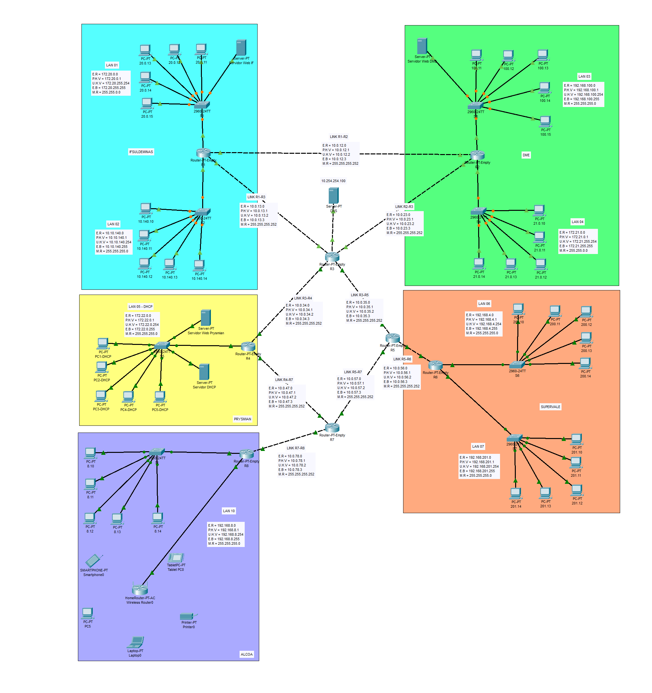

# Projeto de Redes e Sub-redes em Cisco Packet Tracer



## 1. Visão Geral

Projeto acadêmico para a disciplina de Gerência de Redes (Engenharia de Computação), implementando uma topologia robusta no Cisco Packet Tracer com:

- Endereçamento IPv4 personalizado e otimizado
- Múltiplos roteadores interligados
- Serviços avançados: DNS, DHCP, HTTP
- Roteamento dinâmico via RIPv2 com VLSM
- Topologia redesenhada e documentação detalhada

## 2. Topologia da Rede

A rede conecta 8 roteadores em múltiplas áreas, cada uma com serviços distintos:

- **IFSULDEMINAS** (LANs 01 e 02)
- **DME** (LANs 03 e 04)
- **PRYSMIAN** (LAN 05 com DHCP)
- **SUPERVALE** (LANs 06 e 07)
- **ALCOA** (LAN cabeada e wireless)
- **Central** (Servidor DNS)

## 3. Arquitetura e Endereçamento IP

### Estratégia

- Sub-redes específicas para cada LAN e link WAN
- Uso de classes A, B e C para flexibilidade
- VLSM: máscaras /16, /24 e /30 conforme necessidade
- Links WAN enxutos com /30

### Tabela de Endereçamento

| Área         | Rede/Link         | Endereço de Rede      | Gateway        |
|--------------|-------------------|-----------------------|----------------|
| IFSULDEMINAS | LAN 01            | 172.20.0.0/16         | 172.20.0.1     |
|              | LAN 02            | 10.10.140.0/24        | 10.10.140.1    |
| DME          | LAN 03            | 192.168.100.0/24      | 192.168.100.1  |
|              | LAN 04            | 172.21.0.0/16         | 172.21.0.1     |
| PRYSMIAN     | LAN 05 (DHCP)     | 172.22.0.0/24         | 172.22.0.1     |
| SUPERVALE    | LAN 06            | 192.168.200.0/24      | 192.168.200.1  |
|              | LAN 07            | 192.168.201.0/24      | 192.168.201.1  |
| ALCOA        | LAN com Fio       | 192.168.8.0/24        | 192.168.8.1    |
|              | LAN Wireless      | 192.168.9.0/24        | 192.168.9.1    |
| Central      | Rede do DNS       | 10.254.254.0/24       | 10.254.254.1   |
| **Links WAN**| R1 ↔ R3           | 10.0.13.0/30          | 10.0.13.1/.2   |
|              | R2 ↔ R3           | 10.0.23.0/30          | 10.0.23.1/.2   |
|              | ...               | ...                   | ...            |

## 4. Configurações e Serviços

### 🚦 Roteamento Dinâmico

- RIPv2 em todos os roteadores
- Suporte a VLSM e rotas dinâmicas
- Interfaces configuradas manualmente

### 🌐 Serviços de Rede

**DNS Centralizado** (10.254.254.100):

- `www.ifsuldeminas.edu.br` → 172.20.0.10
- `www.dme.com.br` → 192.168.100.10
- `www.prysmian.com.br` → 172.22.0.10

**DHCP** (PRYSMIAN):

- Servidor: 172.22.0.2
- `ip helper-address` configurado no roteador

**Wireless (ALCOA):**

- WPA2-PSK, SSID personalizado

**Servidores Web:**

- Páginas HTML exclusivas em cada servidor

## 5. Testando a Rede

### Pré-requisitos

- Cisco Packet Tracer 7.3 ou superior
- Aguarde ~1 minuto para convergência do RIP

### Comandos de Teste

```bash
# Teste de conectividade:
ping 192.168.100.10       # LAN 01 → Servidor DME
tracert 192.168.200.10    # Caminho até Supervale

# Teste de serviços:
curl http://www.ifsuldeminas.edu.br
curl http://www.dme.com.br
```

**Validação no Navegador:**  
Acesse nos PCs:

- http://www.ifsuldeminas.edu.br
- http://www.dme.com.br
- http://www.prysmian.com.br

## 6. Desenvolvimento e Autoria

Autor: Alessandro Augusto  
GitHub: [alessandro0augusto0](https://github.com/alessandro0augusto0)  
LinkedIn: [alessandroaugusto-dev](https://www.linkedin.com/in/alessandroaugusto-dev)  
Disciplina: Gerência de Redes - Engenharia de Computação  
Orientador: Prof. Douglas F. S. Nunes

> 📌 **Nota:** Projeto acadêmico. Todo o endereçamento foi criado originalmente para esta implementação.
